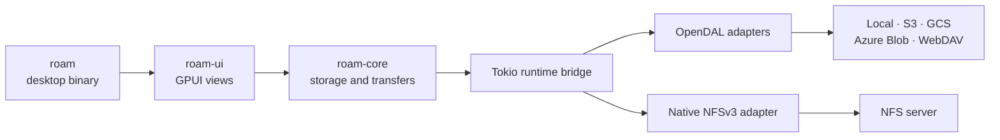

<div align="center">
  
  <h1>Roam</h1>
  <p><strong>One fast desktop file browser for local and remote storage.</strong></p>
  <p>
    Browse your disk, object storage, WebDAV, and NFS from the same native window.<br>
    Move files across backends without changing tools.
  </p>
  <p>
    <a href="https://github.com/yoogoc/roam/actions/workflows/ci.yml"></a>
    <a href="https://github.com/yoogoc/roam/actions/workflows/package.yml"></a>
    
    
  </p>
</div>

Roam is a native file manager built with [GPUI Kit] and [OpenDAL]. Each tab owns
an independent storage session, so a local folder, an S3 bucket, and a WebDAV
server can stay open side by side while Roam transfers data between them.

## Highlights

| | |
| --- | --- |
| **Browse at scale** | Virtualized tables, streamed listings, filtering, sorting, hidden-file controls, and a lazily loaded directory tree. |
| **Work across storage** | Multiple independent tabs and cross-backend copy, upload, download, move, progress, cancellation, and resumable downloads. |
| **Use familiar file tools** | Create folders, rename, duplicate, delete with confirmation, drag files in from Finder, and inspect capability-aware context menus. |
| **Preview before opening** | Built-in previews for text, Markdown, images, directory trees, and ZIP contents, with bounded reads for remote storage. |
| **Stay in control** | Light and dark themes, collapsible sidebar sections, editable keyboard shortcuts, and confirmation before closing a tab or quitting. |
| **Inspect object history** | Browse, preview, download, and restore object versions when the backend exposes versioning. |

## Supported storage

| Backend | Connection notes |
| --- | --- |
| **Local disk** | Browse any directory available to the current user. |
| **Amazon S3 and compatible services** | Supports custom endpoints, path or virtual-host addressing, IAM/environment credentials, RustFS, and other S3-compatible providers. |
| **Google Cloud Storage** | OAuth token or default credentials, with optional custom endpoint support. |
| **Azure Blob Storage** | Account key, SAS/AAD fallback, and optional Azurite-compatible endpoint. |
| **WebDAV** | HTTPS endpoint with optional username, password, and remote path. |
| **NFSv3** | Direct TCP connection with AUTH_SYS; no system mount is required. |

The connection editor is generated from the same backend schema used for
validation and operator construction. It only asks for fields that apply to the
selected service and keeps secret values masked in the UI.

> [!IMPORTANT]
> Connection credentials are stored in `profiles.toml` as plaintext with file
> mode `0600` on Unix. Do not sync, commit, or paste this file into an issue.
> Anyone who can read it can read the saved credentials.

### NFS requirements

Roam speaks NFSv3 directly over TCP. Enter the server and exported absolute
path, plus an optional numeric UID/GID and explicit NFS/Mount ports. When ports
are omitted, Roam discovers them through `rpcbind` on port 111.

The server must allow unprivileged client ports and grant the selected identity
access to the export. NFSv4, Kerberos, and following symbolic links are not
supported. Uploads are written to a temporary file and renamed into place after
the write completes.

## Quick start

Roam currently targets the stable Rust toolchain. Clone the repository and run:

```bash
git clone https://github.com/yoogoc/roam.git
cd roam
cargo run --release
```

The application opens your home directory by default. Pass a path to start
somewhere else:

```bash
cargo run --release -- /path/to/folder
```

Use `ROAM_CONFIG` to place the connection profile somewhere specific, which is
especially useful for development and isolated test runs:

```bash
ROAM_CONFIG=/tmp/roam-profiles.toml cargo run
```

Without that override, `profiles.toml` and `shortcuts.toml` live in the platform
configuration directory selected by the [`directories`] crate.

## Keyboard shortcuts

Open **Settings** from the bottom of the sidebar to edit every application
shortcut. Changes are validated, saved, and applied immediately.

| Action | Default | Action | Default |
| --- | --- | --- | --- |
| Open selection | `Enter` | Parent directory | `Backspace` |
| Back / forward | `⌘ [` / `⌘ ]` | Reload | `⌘ R` |
| Filter directory | `⌘ F` | New folder | `⇧ ⌘ N` |
| Delete selection | `⌘ Backspace` | Toggle preview | `Space` |
| Toggle hidden files | `⇧ ⌘ .` | Download selection | `⌘ D` |
| New / close tab | `⌘ T` / `⌘ W` | Previous / next tab | `⇧ ⌘ [` / `⇧ ⌘ ]` |
| Quit Roam | `⌘ Q` | | |

Closing a tab and quitting Roam always require confirmation. Roam keeps at
least one tab open in the window.

## Architecture



The UI never awaits an OpenDAL operation on a GPUI thread. Network and file I/O
cross the boundary through `roam_core::rt::Rt`, keeping rendering responsive
while listings and transfers continue in the background.

```text
crates/roam-core/   Backend abstraction, cache, previews, transfers, and NFS
crates/roam-ui/     GPUI views, interactions, dialogs, and shortcut settings
crates/roam/        Desktop entry point and packaging metadata
docs/               Architecture decisions and packaging notes
scripts/            Local backend servers for integration tests
```

Read [docs/DESIGN.md](docs/DESIGN.md) for the design decisions, measured scale
results, and backend behavior discovered during implementation.

## Development

Run the same checks used by CI:

```bash
cargo fmt --all --check
cargo clippy --workspace --all-targets --locked -- -D warnings
cargo test --workspace --locked
```

Protocol integration tests use local S3, Azure Blob, GCS, and WebDAV-compatible
servers, so they do not require cloud accounts:

```bash
scripts/test-backends.sh test all
scripts/test-backends.sh test s3       # s3 | azblob | gcs | webdav
scripts/test-backends.sh down
```

The large-directory benchmark is opt-in because its disk-backed case creates
100,000 files:

```bash
ROAM_SCALE_FS=1 cargo test --release -p roam-core --test scale -- --nocapture
```

## Packaging

[cargo-packager] builds the native application bundles and installers:

```bash
cargo install cargo-packager --locked

cargo build --release -p roam
cargo packager -p roam --release --formats app,dmg       # macOS
cargo packager -p roam --release --formats deb,appimage  # Linux
cargo packager -p roam --release --formats nsis          # Windows
```

macOS packaging is the currently verified distribution path. Linux and Windows
package jobs exist in CI but remain marked experimental until their installers
have been validated on target machines. Signing, notarization, platform
dependencies, and release automation are documented in
[docs/PACKAGING.md](docs/PACKAGING.md).

## Project status

Roam is under active development. The core browser and transfer workflows are
implemented and covered by unit, view, scale, and real-protocol integration
tests. Before relying on it for irreplaceable data, keep independent backups and
verify the behavior of your specific storage provider.

[GPUI Kit]: https://github.com/longbridge/gpui-kit
[OpenDAL]: https://opendal.apache.org
[`directories`]: https://docs.rs/directories
[cargo-packager]: https://github.com/crabnebula-dev/cargo-packager
