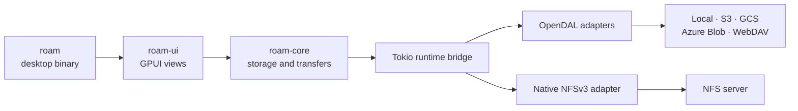

<div align="center">
  
  <h1>Roam</h1>
  <p><strong>One fast desktop file browser for local and remote storage.</strong></p>
  <p>
    Browse your disk, object storage, WebDAV, NFS, and SharePoint from the same native window.<br>
    Move files across backends without changing tools.
  </p>
  <p>
    <a href="https://github.com/yoogoc/roam/actions/workflows/ci.yml"></a>
    <a href="https://github.com/yoogoc/roam/actions/workflows/package.yml"></a>
    
    
  </p>
</div>

Roam is a native file manager built with [GPUI Kit] and [OpenDAL]. Each tab owns
an independent storage session, so a local folder, an S3 bucket, and a WebDAV
server can stay open side by side while Roam transfers data between them.

## Highlights

| | |
| --- | --- |
| **Browse at scale** | Virtualized tables, streamed listings, filtering, sorting, hidden-file controls, and a lazily loaded directory tree. |
| **Work across storage** | Multiple independent tabs and cross-backend copy, upload, download, move, progress in a separate transfer window, cancellation, and resumable downloads. |
| **Use familiar file tools** | Create folders, rename, duplicate, delete with confirmation, drag files in from Finder, and inspect capability-aware context menus. |
| **Preview before opening** | DuckDB data grids, PDF pages, Office content, structured text, images, archive trees, audio controls, and video thumbnails, with bounded reads for remote storage. |
| **Stay in control** | Light and dark themes, collapsible sidebar sections, editable keyboard shortcuts, signed application updates, and confirmation before closing a tab or quitting. |
| **Inspect object history** | Browse, preview, download, and restore object versions when the backend exposes versioning. |

Downloads first open a system folder picker, letting you choose where to save
the selected file or folder. Folder downloads preserve their directory tree;
cancelling the picker starts no transfer.

Uploads and downloads automatically open a separate **Transfer tasks** window.
The browser keeps its full content area. Closing the transfer window leaves
transfers running; use the transfer button at the bottom of the sidebar to
reopen it. Progress, speed, cancellation, retries and completed-task cleanup
are available in that window.

## Application updates

Open **Settings → Application updates**, or use the update button at the bottom
of the sidebar. Roam checks after startup and every 24 hours; automatic downloads
are optional. Stable builds default to the stable channel, and development builds
to the development channel. Restarting to install always requires confirmation,
and is blocked while file transfers are queued or running.

Update manifests and packages are signed. macOS applications, Windows NSIS
installations and Linux AppImages can install updates in place. Source builds,
portable binaries and Debian packages offer a release-page link for manual or
package-manager installation. Older Roam versions need one manual upgrade to
receive this feature. See [release and signing setup](docs/PACKAGING.md#自动更新).

## Supported storage

| Backend | Connection notes |
| --- | --- |
| **Local disk** | Browse any directory available to the current user. |
| **Amazon S3 and compatible services** | Supports custom endpoints, path or virtual-host addressing, IAM/environment credentials, RustFS, and other S3-compatible providers. |
| **Google Cloud Storage** | OAuth token or default credentials, with optional custom endpoint support. |
| **Azure Blob Storage** | Account key, SAS/AAD fallback, and optional Azurite-compatible endpoint. |
| **WebDAV** | HTTPS endpoint with optional username, password, and remote path. |
| **SFTP** | Direct Rust SSH/SFTP client with username/password authentication and verified server fingerprints. |
| **NFSv3** | Direct TCP connection with AUTH_SYS; no system mount is required. |
| **SharePoint Online** | Microsoft Graph libraries by Drive ID; Client Secret, PFX certificate, access token or refresh token authentication, and an optional library subdirectory. |

The connection editor is generated from the same backend schema used for
validation and operator construction. It only asks for fields that apply to the
selected service and keeps secret values masked in the UI.

> [!IMPORTANT]
> Connection credentials are stored in `profiles.toml` as plaintext with file
> mode `0600` on Unix. Do not sync, commit, or paste this file into an issue.
> Anyone who can read it can read the saved credentials.

### SharePoint Online

Select **SharePoint** in the connection editor and enter the document library's
**Drive ID**. This identifies a library, rather than a site URL or sharing link.
To find it, resolve your site with
[`GET /sites/{hostname}:/{site-path}`](https://learn.microsoft.com/en-us/graph/api/site-getbypath?view=graph-rest-1.0),
then list its libraries with
[`GET /sites/{site-id}/drives`](https://learn.microsoft.com/en-us/graph/api/drive-list?view=graph-rest-1.0)
and copy the target library's `id`. Leave **Directory** empty to browse the
library root, or enter a path within that library.

Choose one authentication method:

- **Client Secret (default):** enter **Tenant ID**, **Client ID**, and the
  Entra application's **Client Secret value** (not its secret ID). Roam obtains
  Microsoft Graph access tokens automatically using `client_credentials` and
  renews them before expiry. No access or refresh token needs to be entered.
- **PFX certificate:** enter **Tenant ID** and **Client ID**, then drag one
  `.pfx`/`.p12` file into the connection dialog (or use **Choose file**) and
  enter its password if any. The file must contain one RSA private key of at
  least 2048 bits and its matching certificate. The matching public
  certificate must already be registered on the Entra application. Roam signs
  PS256 client assertions and automatically obtains and renews access tokens.
  Dropping stages the file in memory. Saving validates it and copies it into
  Roam's configuration directory under `certificates/`, with owner-only file
  permissions on Unix. The original file can then be moved or deleted;
  profiles point at Roam's copy and retain the password and display filename.
  Cancelling discards the staged file. Replacing the certificate or deleting
  the connection removes copies no longer used by any saved connection.
  Older connections using external certificate paths are imported on their
  next save. Modern and legacy PKCS#12
  encryption are supported; PFX passwords retain leading and trailing spaces.
- **Access token:** paste a Microsoft Graph token with access to the library.
  When it expires, edit the connection and replace it.
- **Refresh token:** enter a delegated refresh token and the **Client ID** of
  the Entra application that issued it. Public clients leave **Client Secret**
  empty; confidential clients also supply their secret. Roam refreshes access
  tokens automatically and keeps rotated refresh tokens for the current session.

For application authentication, use Microsoft Graph **application** permissions
with administrator consent: `Sites.Read.All` for reading, `Sites.ReadWrite.All`
for writing, or `Sites.Selected` with a separate grant on the target site.
Delegated permissions alone do not grant an application access. Tenant ID can
be a directory ID or verified tenant domain (for example,
`contoso.onmicrosoft.com`). These credentials must belong to an Entra app
registration; legacy SharePoint ACS app secrets are not supported. See
[client credentials](https://learn.microsoft.com/en-us/entra/identity-platform/v2-oauth2-client-creds-grant-flow),
[certificate assertions](https://learn.microsoft.com/en-us/entra/identity-platform/certificate-credentials),
and [selected permissions](https://learn.microsoft.com/en-us/graph/permissions-selected-overview).

The token must target Microsoft Graph, and the application must have consented
permissions for the library. For delegated access, `Files.Read.All` allows
reading accessible files and `Files.ReadWrite.All` allows writing them;
site discovery additionally requires `Sites.Read.All`. Request `offline_access`
when obtaining a refresh token. See the
[Microsoft Graph permissions reference](https://learn.microsoft.com/en-us/graph/permissions-reference)
and [OAuth flow documentation](https://learn.microsoft.com/en-us/entra/identity-platform/v2-oauth2-auth-code-flow).

This connection supports SharePoint Online on the global Microsoft Graph
endpoint. Browser sign-in,
SharePoint Server, national cloud endpoints, share links, and version history
are not available. Uploads above 4 MiB use Graph upload sessions; uploads retain
Roam's existing 512 MiB limit for backends that require a complete file buffer.

### SFTP

Select **SFTP** and enter the server hostname or IP, port (default `22`),
username and password. **Remote directory** defaults to `/` and sets the
starting directory. Passwords retain leading and trailing spaces.

Roam uses `russh` and `russh-sftp` directly for SSH authentication and file IO;
OpenDAL's SFTP service and external SSH programs are not used. First connection
checks `~/.ssh/known_hosts`. For an unknown server, Roam shows its SHA256
fingerprint before sending credentials. Confirming saves that fingerprint in
the connection; a changed fingerprint blocks authentication. You can also enter
a verified SHA256 fingerprint under **Advanced**.

Directory browsing, previews, streaming uploads/downloads, directory creation,
rename and deletion are supported. Uploads use temporary files and publish by
rename after completion. Overwriting requires a server that supports
`posix-rename@openssh.com` (such as OpenSSH); on other servers an existing target
may cause the upload to fail without replacing it. Server-side copy, share links,
version history, key authentication and keyboard-interactive login are not
available. Transfers can still stream files between connections.

### NFS requirements

Roam speaks NFSv3 directly over TCP. Enter the server and exported absolute
path, plus an optional numeric UID/GID and explicit NFS/Mount ports. When ports
are omitted, Roam discovers them through `rpcbind` on port 111.

The server must allow unprivileged client ports and grant the selected identity
access to the export. NFSv4, Kerberos, and following symbolic links are not
supported. Uploads are written to a temporary file and renamed into place after
the write completes.

## Quick start

Roam currently targets the stable Rust toolchain. Clone the repository and run:

```bash
git clone https://github.com/yoogoc/roam.git
cd roam
cargo run --release
```

The application opens your home directory by default. Pass a path to start
somewhere else:

```bash
cargo run --release -- /path/to/folder
```

Use `ROAM_CONFIG` to place the connection profile somewhere specific, which is
especially useful for development and isolated test runs:

```bash
ROAM_CONFIG=/tmp/roam-profiles.toml cargo run
```

Without that override, `profiles.toml` and `shortcuts.toml` live in the platform
configuration directory selected by the [`directories`] crate.

## Keyboard shortcuts

See [supported preview formats and limits](docs/PREVIEWS.md) for file previews,
DuckDB grids, and the optional FFmpeg requirement for video thumbnails.

Open **Settings** from the bottom of the sidebar to edit every application
shortcut. Changes are validated, saved, and applied immediately.

| Action | Default | Action | Default |
| --- | --- | --- | --- |
| Open selection | `Enter` | Parent directory | `Backspace` |
| Back / forward | `⌘ [` / `⌘ ]` | Reload | `⌘ R` |
| Filter directory | `⌘ F` | New folder | `⇧ ⌘ N` |
| Delete selection | `⌘ Backspace` | Toggle preview | `Space` |
| Toggle hidden files | `⇧ ⌘ .` | Download selection | `⌘ D` |
| New / close tab | `⌘ T` / `⌘ W` | Previous / next tab | `⇧ ⌘ [` / `⇧ ⌘ ]` |
| Quit Roam | `⌘ Q` | | |

Closing a tab and quitting Roam always require confirmation. Roam keeps at
least one tab open in the window.

## Architecture


```mermaid
flowchart LR
    UI["roam-ui<br>GPUI views"] --> Core["roam-core<br>storage and transfers"]
    App["roam<br>desktop binary"] --> UI
    Core --> Runtime["Tokio runtime bridge"]
    Runtime --> OpenDAL["OpenDAL adapters"]
    Runtime --> NFS["Native NFSv3 adapter"]
    OpenDAL --> Backends["Local · S3 · GCS<br>Azure Blob · WebDAV"]
    NFS --> Server["NFS server"]
```

The UI never awaits an OpenDAL operation on a GPUI thread. Network and file I/O
cross the boundary through `roam_core::rt::Rt`, keeping rendering responsive
while listings and transfers continue in the background.

```text
crates/roam-core/   Backend abstraction, cache, previews, transfers, and NFS
crates/roam-ui/     GPUI views, interactions, dialogs, and shortcut settings
crates/roam/        Desktop entry point and packaging metadata
docs/               Architecture decisions and packaging notes
scripts/            Local backend servers for integration tests
```

Read [docs/DESIGN.md](docs/DESIGN.md) for the design decisions, measured scale
results, and backend behavior discovered during implementation.

## Development

`cargo run` optimizes the GPUI layout and drawing dependencies while retaining
debug builds for Roam's own crates. To inspect connection-dialog frame timings:

```bash
ROAM_DIALOG_PROFILE=/tmp/roam-dialog-profile.txt \
  cargo run -p roam-ui --features profiler --example connection_dialog
# Add -- --compact to check the narrow-window layout.
```

Interact with the dialog, then read the timing file for draw and input latency
percentiles. Profiling is optional and disabled in normal builds.

Run the same checks used by CI:

```bash
cargo fmt --all --check
cargo clippy --workspace --all-targets --locked -- -D warnings
cargo test --workspace --locked
```

Protocol integration tests use local S3, Azure Blob, GCS, and WebDAV-compatible
servers, so they do not require cloud accounts:

```bash
scripts/test-backends.sh test all
scripts/test-backends.sh test s3       # s3 | azblob | gcs | webdav
scripts/test-backends.sh down
```

The large-directory benchmark is opt-in because its disk-backed case creates
100,000 files:

```bash
ROAM_SCALE_FS=1 cargo test --release -p roam-core --test scale -- --nocapture
```

## Packaging

[cargo-packager] builds the native application bundles and installers:

```bash
cargo install cargo-packager --locked

cargo build --release -p roam
cargo packager -p roam --release --formats app,dmg       # macOS
cargo packager -p roam --release --formats deb,appimage  # Linux
cargo packager -p roam --release --formats nsis          # Windows
```

macOS packaging is the currently verified distribution path. Linux and Windows
package jobs exist in CI but remain marked experimental until their installers
have been validated on target machines. Signing, notarization, platform
dependencies, and release automation are documented in
[docs/PACKAGING.md](docs/PACKAGING.md).

## Project status

Roam is under active development. The core browser and transfer workflows are
implemented and covered by unit, view, scale, and real-protocol integration
tests. Before relying on it for irreplaceable data, keep independent backups and
verify the behavior of your specific storage provider.

[GPUI Kit]: https://github.com/longbridge/gpui-kit
[OpenDAL]: https://opendal.apache.org
[`directories`]: https://docs.rs/directories
[cargo-packager]: https://github.com/crabnebula-dev/cargo-packager
